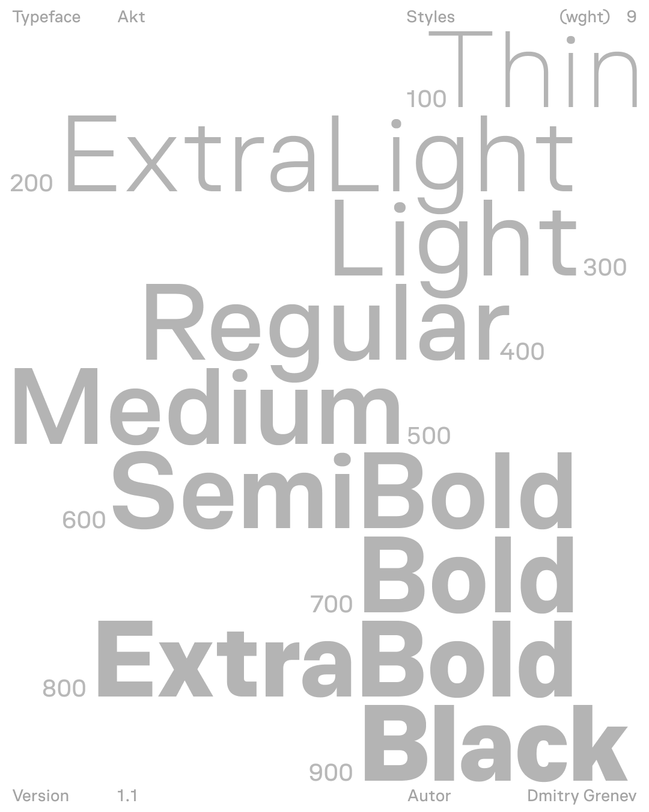

# Akt — a powerful typeface crafted for modern user interfaces

Akt is a contemporary sans-serif typeface crafted for clarity and precision in modern digital design. Built with an interface-first approach, it ensures consistent behavior across layouts, components, and viewports — a dependable foundation for UI and design systems.
Each weight is designed with intent: mid-range weights support comfortable reading, while heavier ones add focus and structure to titles and key visual elements.
Balancing rational geometry with refined optical details, Akt offers the precision developers need and the flexibility designers expect — a unified typographic system for modern interfaces and branding. Designed by Dima Grenev.

[Download ↓](https://github.com/dimgrenev/akt/archive/refs/tags/v1.0.zip)

## Features

**Unified glyphs width** across all weights (Thin → Black), ensuring predictable line and UI-element width behavior during text weight adjustments. This attribute also aids in optimizing text density for dark themes – simply shift one weight step lighter for balanced contrast.  
**Capitals** are vertically **centered within the line height**, creating harmonious alignment with icons. 
**Terminals** (endpoints of rounded strokes) are horizontally **calibrated** for visual consistency.  
**1,200+ glyphs** and supports **400+ languages** using **Extended Latin & Cyrillic** scripts.  
There are **9 font weights available** (Thin → Black).

## Build

> **Note** To build from source, you'd need Python 3.9.5 or higher (install instructions for Python [available here](https://wiki.python.org/moin/BeginnersGuide/Download)).

The source files can be found in the *"Source"* folder. To open them you will need Glyphs app.\
To build the `.ttf`, `.otf`, `woff2` & variable `.ttf` you will need to:
- Install **gftools** `pip install gftools`
- Install **fonttools[woff]** `pip install fonttools[woff]`
- Navigate to **Akt** folder in Terminal app.
- Type `gftools builder sources/config.yaml` in Terminal and run it.
- To generate variable webfonts, use the build artifacts created by `make build` (the variable TTFs in fonts/variable). Conversion to woff2 can be handled by your deployment pipeline or gftools if needed.
- After the scripts are complete, the files can be found in *fonts* folder.

## License

This Font Software is licensed under the SIL Open Font License, Version 1.1.
This license is available with a FAQ at https://openfontlicense.org
