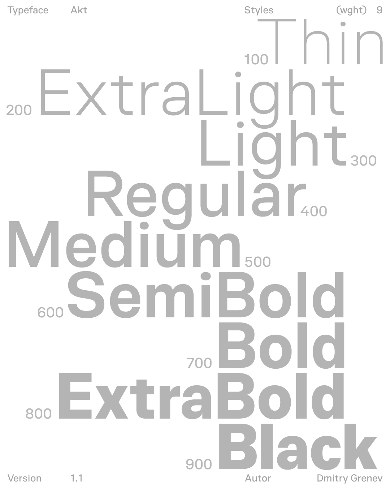

# Akt — a powerful typeface crafted for modern user interfaces

Akt is a contemporary sans-serif typeface crafted for clarity and precision in modern digital design. Built with an interface-first approach, it ensures consistent behavior across layouts, components, and viewports — a dependable foundation for UI and design systems.
Each weight is designed with intent: mid-range weights support comfortable reading, while heavier ones add focus and structure to titles and key visual elements.
Balancing rational geometry with refined optical details, Akt offers the precision developers need and the flexibility designers expect — a unified typographic system for modern interfaces and branding. Designed by Dima Grenev.

[Download ↓](https://github.com/dimgrenev/akt/releases/latest)

## Features

**Unified glyphs width** across all weights (Thin → Black), ensuring predictable line and UI-element width behavior during text weight adjustments. This attribute also aids in optimizing text density for dark themes – simply shift one weight step lighter for balanced contrast.  
**Capitals** are vertically **centered within the line height**, creating harmonious alignment with icons. 
**Terminals** (endpoints of rounded strokes) are horizontally **calibrated** for visual consistency.  
**1,800+ glyphs** and supports **400+ languages** using **Extended Latin, Extended Cyrillic, Greek, and basic IPA** scripts.  
There are **9 font weights available** (Thin → Black).

## Build

> **Note** To build from source, you'd need Python 3.9.5 or higher (install instructions for Python [available here](https://wiki.python.org/moin/BeginnersGuide/Download)).

The source files can be found in the *"Source"* folder. To open them you will need Glyphs app.\
The canonical build entrypoint is `make build`:
- Navigate to the **Akt** folder in Terminal.
- Run `make build`.
- The build bootstraps a local virtual environment and runs the post-processing scripts used by this repository.
- The packaged output is `ofl/akt/Akt[wght].ttf`.

Current repository scope:
- The repo currently builds a single variable TTF.
- `make test` runs FontBakery and refreshes reports in `sources/fontbakery/` and `sources/badges/`.
- Directly running `gftools builder sources/config.yaml` is possible, but it skips the repository's post-processing steps from the Makefile.
- OTF and WOFF2 artifacts are not produced by the current checked-in pipeline.

## License

This Font Software is licensed under the SIL Open Font License, Version 1.1.
This license is available with a FAQ at https://openfontlicense.org
