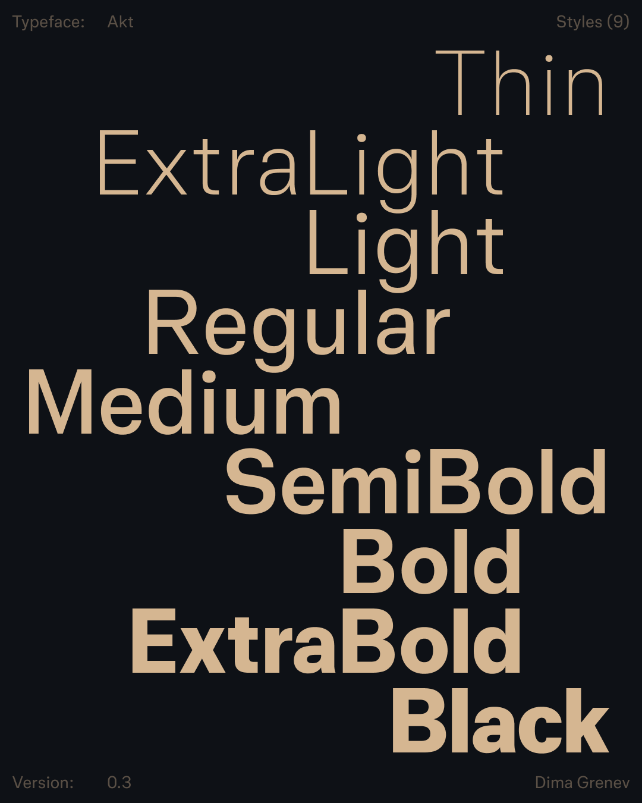

# Akt — a powerful typeface for modern user needs

**Unified glyphs width** across all weights (thin → black), ensuring predictable line and UI-element width behavior during text weight adjustments. This attribute also aids in optimizing text density for dark themes – simply shift one weight step lighter for balanced contrast.  
**Capitals** are vertically **centered within the line height**, creating harmonious alignment with icons. **Terminals** (endpoints of rounded strokes) are horizontally **calibrated** for visual consistency.  
**1,200+ glyphs** and supports **400+ languages** using **Extended Latin & Cyrillic** scripts. Designed by Dima Grenev.

[Download](https://github.com/dimgrenev/Akt/releases/latest) latest release.

## Font Styles

There are 9 font styles available, from Thin to Black.

## Features

## Ligatures

## Building from source files

## License

This Font Software is licensed under the SIL Open Font License, Version 1.1.
This license is available with a FAQ at https://openfontlicense.org
